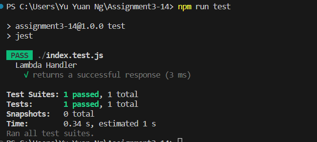

# Assignment3-14

A brief description of what tools and procedure used in this assignment.
### Github Repository 

[Procedures of creating new Repository](https://docs.github.com/en/get-started/quickstart/create-a-repo)

### Github Action

[Introduction of Github Action](https://docs.github.com/en/actions/learn-github-actions/understanding-github-actions)

### Visual Studio Code

[Getting started with Visual Studio Code](https://code.visualstudio.com/docs/introvideos/basics)

#### READme.md

Include the overall steps and tools used in this assignment. 

#### serverless.yml

```bash
# CHANGE-TO-YOURNAME-aws-node-http-api-project to your repo name! in line 2, service.
service: Assignment3-15
frameworkVersion: '3'

provider:
  name: aws
  runtime: nodejs18.x
  region: ap-southeast-1

functions:
  api:
    handler: index.handler
    events:
      - httpApi:
          path: /yuyuan-cluster
          method: get
    environment:
      ACCESS_KEY: ${ssm:yuyuan-parameter}

plugins:
  - serverless-offline
  ```

### index.js
```bash
# CHANGE-TO-YOURNAME-aws-node-http-api-project to your repo name! in line 2, service.
service: Assignment3-15
frameworkVersion: '3'

provider:
  name: aws
  runtime: nodejs18.x
  region: ap-southeast-1

functions:
  api:
    handler: index.handler
    events:
      - httpApi:
          path: /yuyuan-cluster
          method: get
    environment:
      ACCESS_KEY: ${ssm:yuyuan-parameter}

plugins:
  - serverless-offline
```
### index.test.js
```bash
const { handler } = require('./index');

describe('Lambda Handler', () => {
  it('returns a successful response', async () => {
    const event = { key: 'value' };
    const expectedResponse = {
      statusCode: 200,
      body: JSON.stringify(
        {
          message: "Go Serverless v3.0! Your function executed successfully!",
          input: event,
        },
        null,
        2
      ),
    };
    const response = await handler(event);
    expect(response).toEqual(expectedResponse);
  });
});

```

### .github/workflows/main.yml
```bash
name: CICD for Serverless Application
run-name: ${{ github.actor }} is doing CICD for serverless application

on:
  push:
    branches: [ main, "*" ]

jobs:
  pre-deploy:
    runs-on: ubuntu-latest
    steps:
      - run: echo "The job is automatically triggered by a ${{ github.event_name }} event."

  install-dependencies:
    runs-on: ubuntu-latest
    needs: pre-deploy
    steps:
      - name: Check out repository code
        uses: actions/checkout@v3
      - name: Run installation of dependencies commands
        run: npm install

  unit-testing:
    runs-on: ubuntu-latest
    needs: install-dependencies
    steps:
      - name: Check out repository code
        uses: actions/checkout@v3
      - name: Run installation of dependencies commands
        run: npm install
      - name: Run unit testing command
        run: npm test
  
  package-scan:
    runs-on: ubuntu-latest
    needs: unit-testing
    steps:
      - name: Check out repository code
        uses: actions/checkout@v3
      - name: Run installation of dependencies commands
        run: npm install
      - name: Run audit
        run: npm audit

  deploy:
    runs-on: ubuntu-latest
    needs: package-scan
    steps:
    - uses: actions/checkout@v3
    - name: Use Node.js ${{ matrix.node-version }}
      uses: actions/setup-node@v3
      with:
        node-version: ${{ matrix.node-version }}
    - run: npm ci
    - name: serverless deploy
      uses: serverless/github-action@v3.2
      with:
        args: deploy
      env:
        AWS_ACCESS_KEY_ID:  ${{ secrets.AWS_ACCESS_KEY_ID }}
        AWS_SECRET_ACCESS_KEY:  ${{ secrets.AWS_SECRET_ACCESS_KEY }}
            
```
### Command and Steps to Run in Visual Studio Code under terminal
- Git clone <repository ssh>
- Npm init 
- Npm install serverless - package.json will appear
- Create index.js
- Create serverless.yml 
- Npm install serverless-offline- package-lock.json will appear
- Move the node_module into .gitignore
- Npm install serverless-offline -save-dev
- Run” serverless deploy”
- Run “serverless remove” 
- Add in .github/workflows/main.yml
- Add in pre-deploy, install dependencies, unit testing, audit check and deploy into main.yml
- Add in ASCCES_KEY and parameter in index.js and serverless.yml
- Carry out Github Action and Run the workflow.

Unit testing thourgh commmand "npm run test" is passed. 

